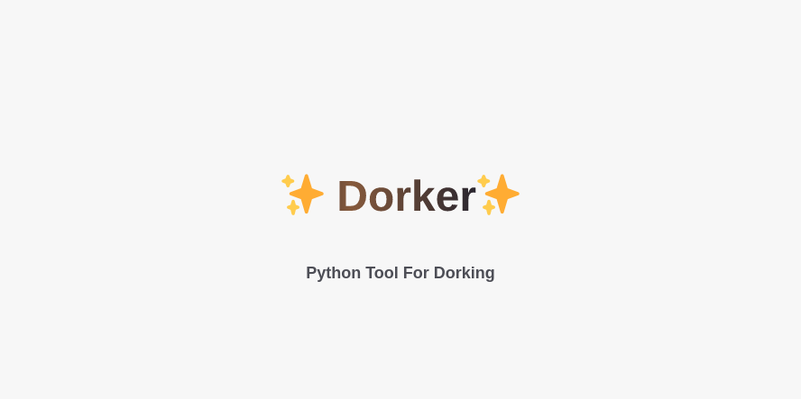

# 🔥 Dorker 🔥
Dorker is a Python tool that generates Google, Shodan, GitHub, GitLab etc. dorking commands for web application penetration testing.



# ✨ Features
- Generates Google, Shodan, GitHub, GitLab & many more dorking commands
- Allows users to customize the search parameters
- Provides relevant and targeted results for web application penetration testing

# ✅ Installation
1. Clone the repository: 
`git clone https://github.com/nerrorsec/Dorker.git`
2. Navigate to the repository directory: `cd Dorker`
3. Install the required libraries: `pip install -r requirements.txt`

# ➡️ Usage
1. Run the tool: 
```bash
python3 dorker.py -t google.com -o google_out
python3 dorker.py -l list.txt -o lists
```
2. That's it

# 🪜 Examples
Here are some examples of the commands generated by Google Dorker:

### Google
```bash
site:example.com intext:"admin login"
```
### Shodan
```bash
http.title:"admin panel" country:"US"
```
### GitHub
```bash
filename:.env path:config
```
### GitLab
```bash
filename:database.yml path:config
```
# ✍️ Contributing
Contributions are welcome and encouraged! If you find any bugs or issues, please open a new issue. If you would like to contribute to the project, please fork the repository and submit a pull request.

# 🪪 License
Dorker is released under the MIT License.